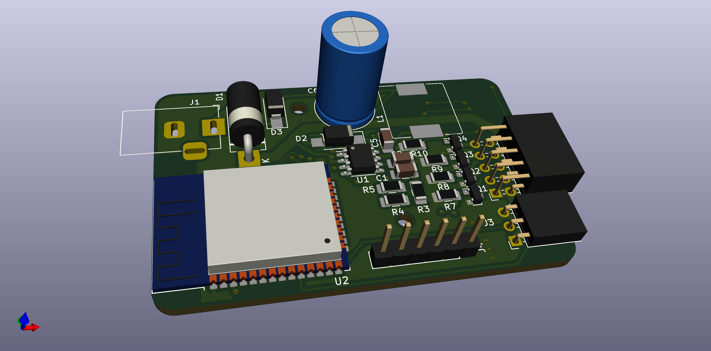

# IoT LED strip controller
An open source hardware implementation of a IoT controller for LED strips.

This board is based on an ESP32-WROOM module and can control 2 RGB(W) and one Neopixel-like strip with a supply between 5V and 24V. Each channel can sink up to 3.4A continuous through the DMN3404L driver MOSFETs.

The ESP32 allows IoT applications over the Internet (eg., Alexa, Google Home, etc) as well as over Bluetooth (eg., P2P mobile app). The ESP32 is powered through an on-board switch-mode power supply that works over the LED input voltage range of 5V to 24V.

